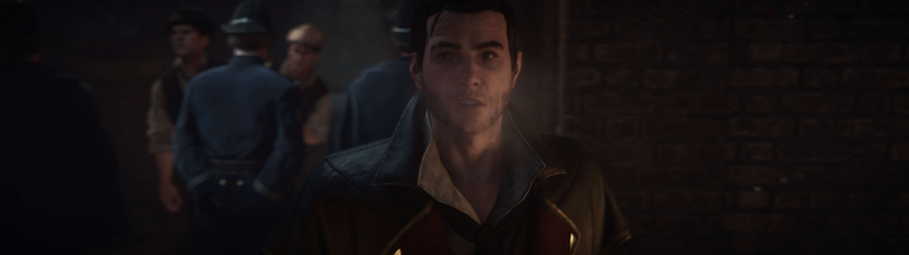

## Assassin's Creed Syndicate ultrawide cutscenes

The tool removes the side black bars from the real-time cutscenes of the game, as seen in its earlier versions.

1. [Download](/../../releases) and unpack the archive.
2. Launch the game first, followed by the tool.
3. Press the hotkeys in the order they are listed.
* Ensure that each function blinks green and try to wait a few seconds after each step leading to the black bars toggle.

All trainers based on CE components may trigger some anti-virus software.

Tested on the latest Steam version at 2560x1080, 3840x1080 and 5760x1080.

You can buy me a [coffee](https://ko-fi.com/rozziroxx) or become a [patron](https://www.patreon.com/rozzi).

### Credits
See the tool description.

